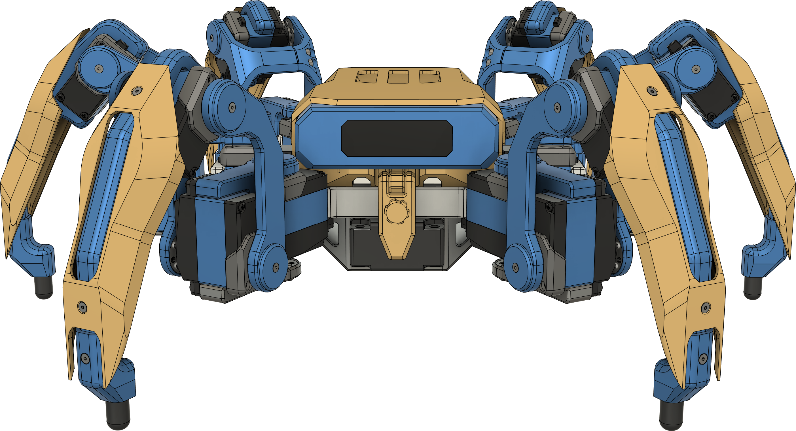
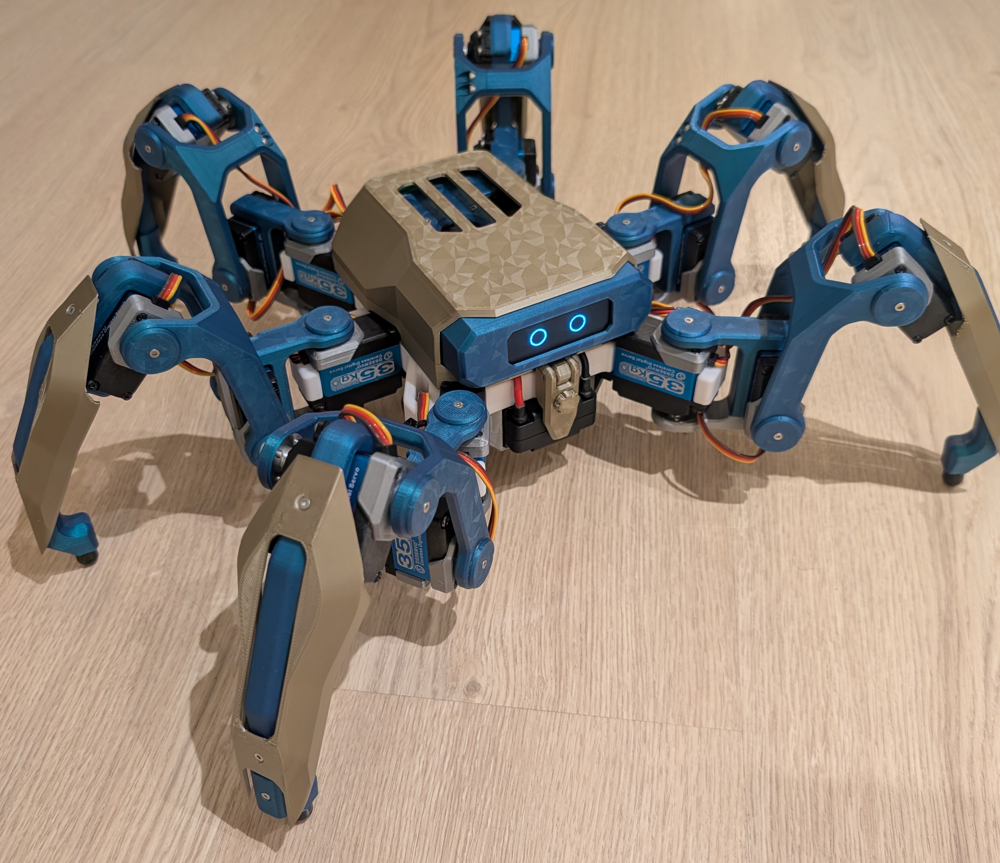
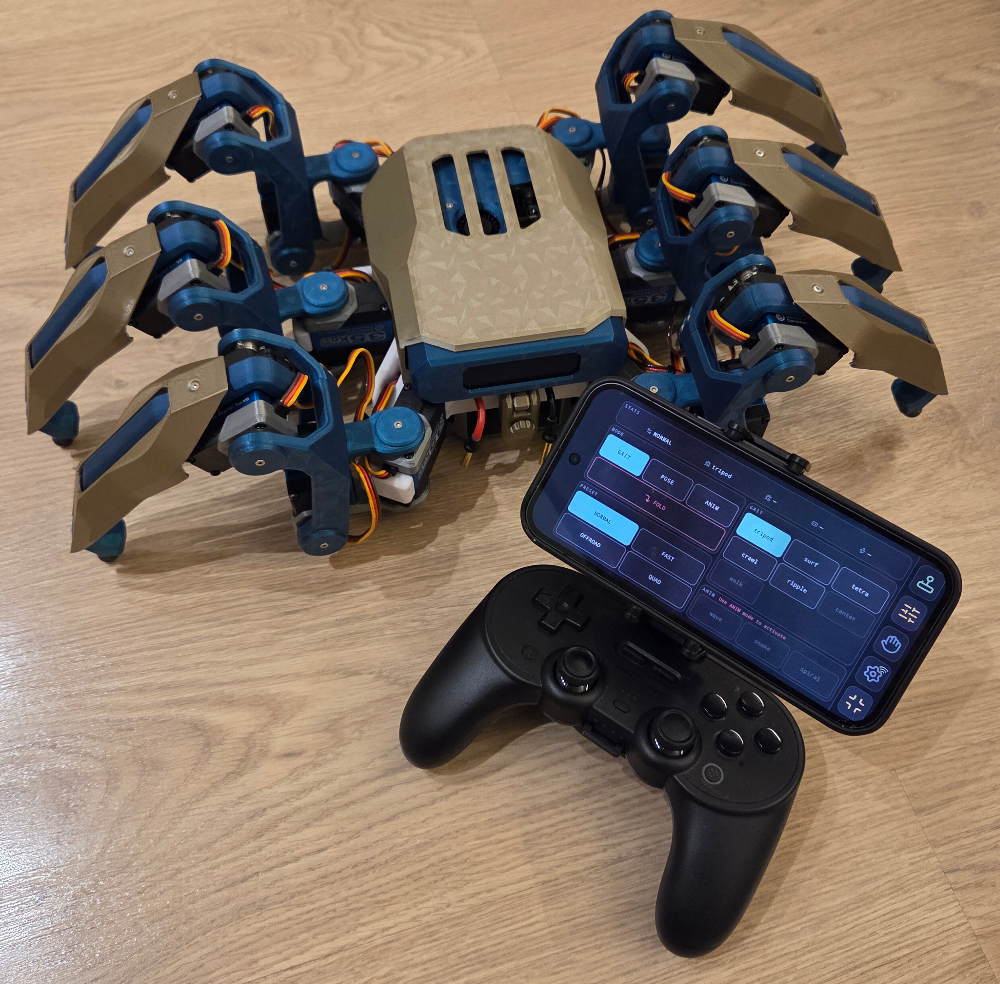
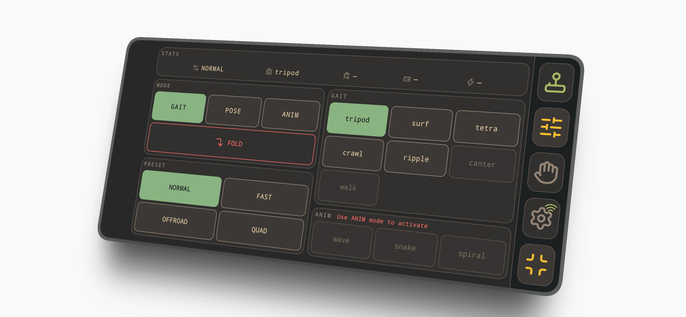
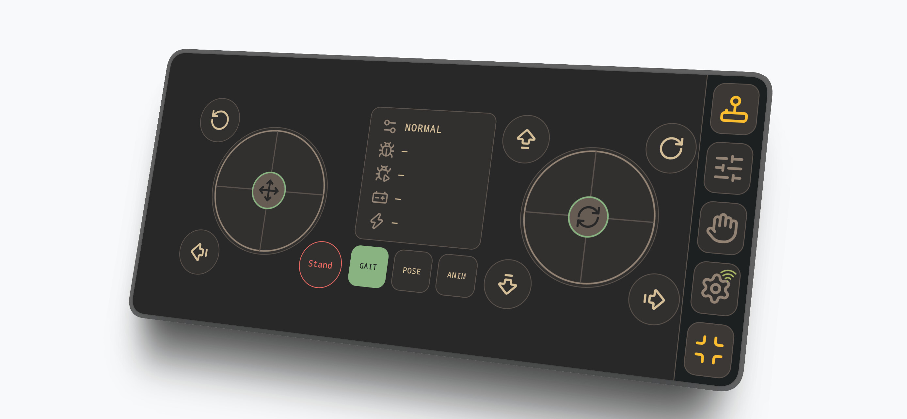

# hexapod-build

## Introduction

This is the main build repository for a hexapod I've designed and built. This and the two companion repositories contain instructions to build and drive the hexapod.

> [!WARNING]
> This is a challenging, purely DIY project. Use these instructions at you own risk. There is no support, warranty or throubleshooting help. If you want to build it, be prepared to do figure out any issues you may run into yourself.
>
> NOTE: A simpler/cheaper build is in the works using a Pi Pico 2 W instead of a rasperry pi.

The hexapod can be controlled with an xbox (or equivalent) controller or a webapp hosted via wifi on the rasperry pi running the robot.

## Resources 

- [`instructions`](instructions-v1.0.0.pdf) - Build instructions
- [`prints/`](prints) — Print files (`.3mf`).
- [`cad/`](cad) — CAD models (`.step`).

## Companion repositories

The hexapod software is hosted on two repositories, which contain instructions how to get the hexapod running.
- [olli-io/hexapod-ros2-control](https://github.com/olli-io/hexapod-ros2-control) — ROS 2 control stack for the 6-leg / 18-DOF hexapod. Runs in docker on a Raspberry Pi 5. Also includes a Gazebo sim container for linux.
- [olli-io/hexapod-servo2040-driver](https://github.com/olli-io/hexapod-servo2040-driver) — Firmware for the Pimoroni Servo 2040 (RP2040). Drives the 18 servos over UART.

## Contributions

I am open to contributions. Example: if you use your time to modify the leg parts to accomodate a servo with different dimensions, please let me know and we can add it to the repo.

The [MYP hexapod](https://github.com/MakeYourPet/hexapod) and [Aecert's hexapod](https://github.com/Ryan-Mirch/Aecerts_Hexapod_V1) are spiritual predecessors of this project. Ideas have been taken from both of these projects.

> [!NOTE]
> This work is licensed under the [Creative Commons Attribution-NonCommercial 4.0 International License (CC BY-NC 4.0)](https://creativecommons.org/licenses/by-nc/4.0/). See [`LICENSE`](LICENSE).

## Images

